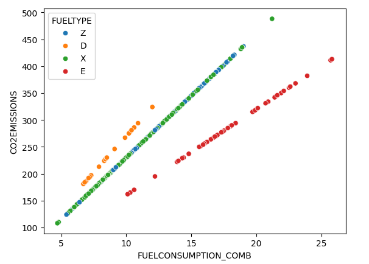

# dummie-lineal-regression
Sometimes a simple feature may make a hugh difference in how to solve a lineal regression problem. This small code split the data by a categorical feature and run a linear regression per each one.

The example is particulary simple, beacause CO2 Emissions is linearly dependent by fuel consumption per each fuel type.

But it can be used for more complex problems
